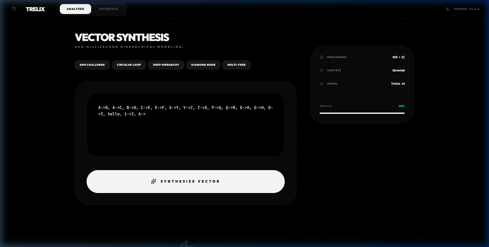
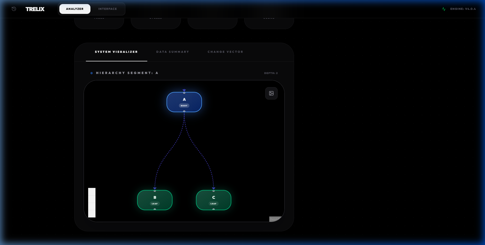
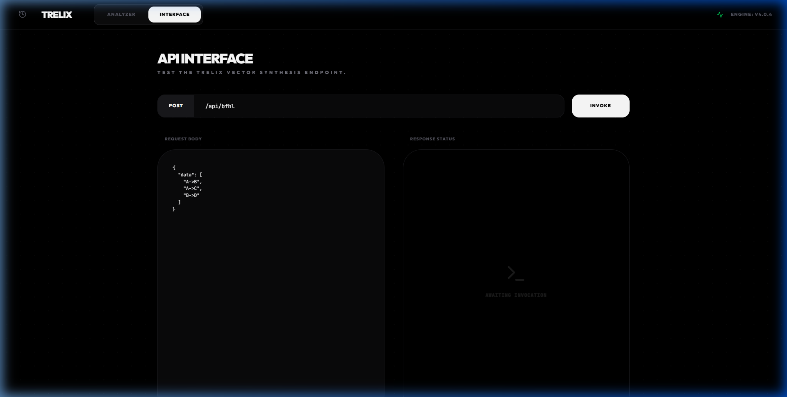

# Trelix: Hierarchical Vector Synthesis Engine

Trelix is a comprehensive full-stack solution built for the SRM Full-Stack Engineering Challenge. It provides a robust REST API for processing hierarchical node relationships and a high-fidelity frontend for real-time graph visualization and analysis.

---

## Core API Specifications (SRM Challenge)

The Trelix backend implements the BFHL Protocol, strictly adhering to the following challenge requirements:

### 1. Identity & Compliance
- **Operation Code**: Returns operation_code: 1 via GET /api/bfhl.
- **Identity Fields**: Returns verified user_id (fullname_ddmmyyyy), college email, and roll number.
- **CORS Enabled**: Fully accessible from cross-origin evaluators.

### 2. Strict Data Validation
The engine enforces the X->Y vector format where X and Y are single uppercase letters (A-Z).
- **Format Filtering**: Automatically detects and isolates malformed strings (e.g., hello, 1->2, AB->C).
- **Conflict Resolution**: Identifies and reports duplicate edges while preserving the first-encountered instance for tree construction.
- **Self-Loop Protection**: Treats self-referential nodes (e.g., A->A) as invalid entries.

### 3. Hierarchical Synthesis Engine
Trelix implements complex graph logic to build accurate tree structures:
- **Root Identification**: Dynamically identifies root nodes (nodes that never appear as children).
- **The Diamond Rule**: In multi-parent scenarios (e.g., A->D and B->D), the engine follows the challenge requirement: the first parent wins, and subsequent parent edges are discarded.
- **Pure Cycle Handling**: In groups with no natural root (all nodes are children), the lexicographically smallest node is assigned as the representative root.
- **Depth Calculation**: Computes depth as the number of nodes on the longest root-to-leaf path (e.g., A->B->C = 3).

### 4. Cycle Detection & Reporting
The system uses a coloring-based DFS algorithm to isolate cyclic groups.
- **Cyclic States**: Returns has_cycle: true and an empty tree {} for cyclic components.
- **Summary Metrics**: Calculates total valid trees, total cycles, and identifies the largest_tree_root with lexicographical tiebreaking.

---

## Professional Interface

The Trelix frontend is designed for visual excellence and clarity, exceeding the basic challenge requirements.

### Vector Analyzer
A sophisticated input interface that provides sub-millisecond feedback on vector health, entropy, and synthesis scores.



### System Visualizer
An interactive workspace that renders abstract hierarchies into tangible tree structures using a node-based canvas.



### API Interface (Playground)
A built-in developer tool to test the POST endpoint directly, displaying structured JSON responses and status codes.



---

## Technical Architecture

- **Frontend**: Next.js 16 (App Router), Tailwind CSS, Framer Motion.
- **Graph Visualization**: @xyflow/react (React Flow).
- **Backend Logic**: Hybrid implementation (Next.js API Routes + Standalone Express).
- **Algorithms**:
  - **Union-Find (DSU)**: Used for rapid component isolation.
  - **DFS (White/Gray/Black)**: Used for mathematically sound cycle detection.
  - **Recursive Descent**: Used for nested tree object construction.

---

## Installation & Setup

### Prerequisites
- Node.js 18.x or higher

### Local Development
```bash
# Clone and Install
git clone https://github.com/KaveenKrithik/Trelix.git
cd Trelix
npm install

# Run Development Server
npm run dev
```

### Deployment
The project is optimized for deployment on Vercel (Frontend + Serverless API) and Render (Express Backend).

---

**Author:** Kaveen Krithik Kandan  
**Roll:** RA2311033010019  
**License:** MIT
